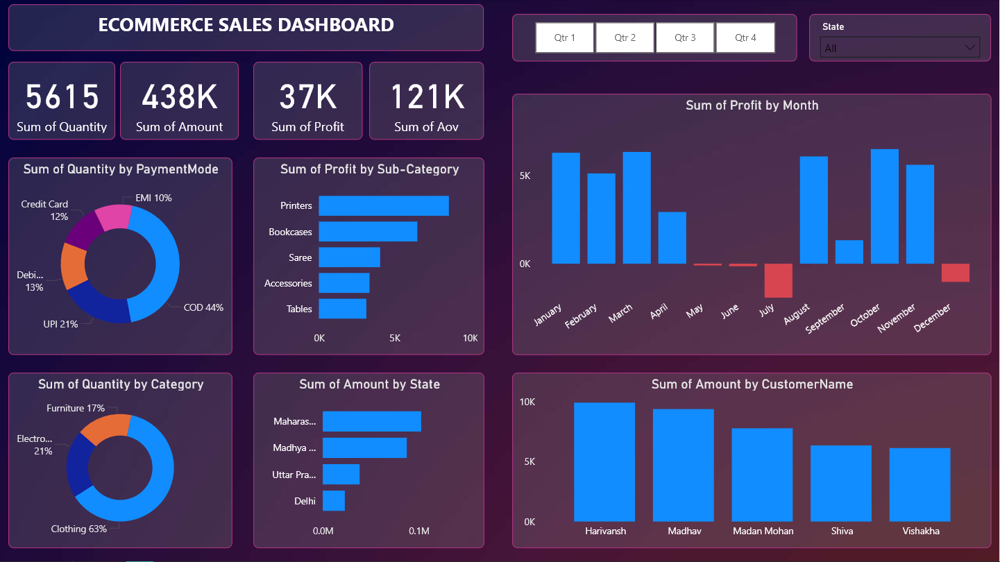

# E-Commerce Sales Dashboard (Power BI)

## Project Overview
This Power BI dashboard analyzes e-commerce sales data to uncover key business insights such as revenue trends, customer behavior, and product performance.

## Objectives
- Analyze overall sales performance
- Identify top-performing products
- Understand customer purchasing patterns
- Track key sales metrics

## Dataset
The dataset contains two tables:
- **Orders** – Contains order details such as order ID, date, amount, and profit
- **Details** – Contains product-level information

Dataset is available in the **data/** folder.

## Dashboard Features
The dashboard provides insights into:

- Total Sales
- Total Profit
- Quantity Sold
- Sales by State
- Sales by Category
- Profit by Sub-Category
- Customer purchasing trends

## Tools Used
- **Power BI**
- **Excel**
- **Data Modeling**
- **DAX**

## Dashboard Preview

## Key Insights
- Maharashtra generated the highest total sales among all states.
- Clothing category contributed the largest share of total quantity sold.
- Electronics produced the highest profit margins compared to other categories.
- Seasonal spikes in sales were observed during peak shopping periods.

## Repository Structure

<!-- Ecom-sales-dashboard
│
├── data
│   ├── Orders.xlsx
│   └── Details.xlsx
│
├── images
│   ├── dashboard.png
│   └── Gradient BG.jpg
│
├── Ecom Sales Report.pbit
│
└── Readme.md -->